# Tutorial WPA2 Handshake bruteforcen:

## Wichtiger Hinweis:

Die gezeigeten Methoden, Befehle und Techniken dienen der Sensibilisierung und dem Selbststudium, und dürfen unter gar keinen Umständen für böse Absichten eingesetzt werden. Darüber hinaus ist es in Deutschland strafbar fremde Netzwerke, Webseite, Server oder ähnliches zu hacken, ohne schriftliche Genehmigung des Eigentümer

### Vorraussetzungen 

Hardware: Laptop/Rechner mit WLAN-Karte<br>
Software: aktuelle [Kali](https://www.kali.org/get-kali/#kali-installer-images)  Version.

### Let´s Hack

Zunächst müssen wir die WLan-Karte in den Monitormodus versetzen, denn wir benötigen diese es unser Werkzeug.
* WLAN-Karte vorbereiten
  ```sh
  sudo airmon-ng start wlan0 
  ```

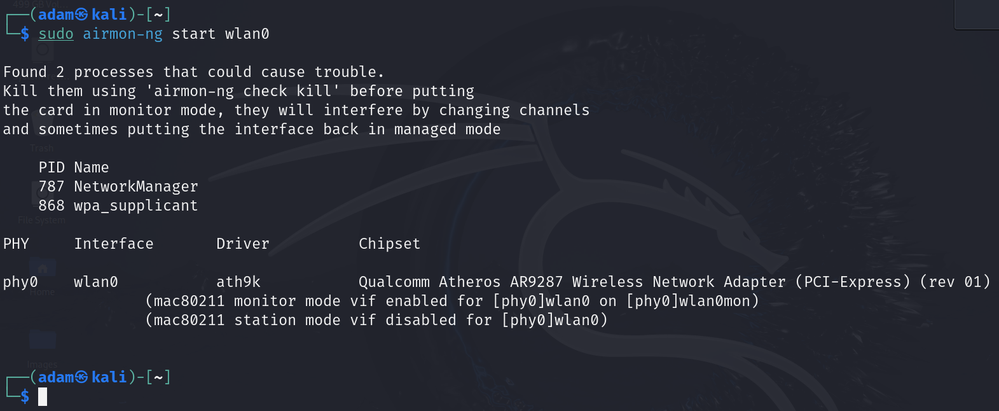
Wir werden von Kali darauf hingewiesen dass noch zwei Prozesse auf die Karte zugreifen. Uns wird auch der passende Befehl angeboten um diese beiden Prozesse zu beenden (killen)
  
  ```sh
  sudo airmon-ng check kill
  ```

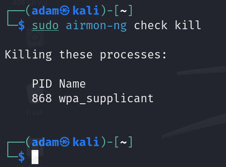

Danach steht und die Wlan-Karte voll und ganz zur Verfügung.
Nun schauen wir was wir alles in unsrer Umgebung empfangen können.
  ```sh
  sudo airodump-ng start wlan0mon
  ```
wlan0mon ist nun der Name unseres Netzwerkinterfaces welches sich im Monitor-Mode befindet daher das "mon" am Ende
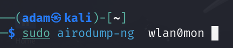

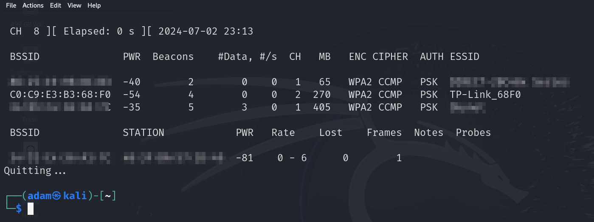

Was sehen wir nun? Wie kann man das angezeigte interpretieren?
Wir sehen also drei Netzwerk im Reichweite.
In der ersten Spalte sehen wir die einzigartigen BSSID von den Netzwerken, gefolgt von der Spalte PWR als abkürzung für Power die Werte die wir hier sehen sind immer negativ da sich diese auf die Signalstärke in dbm beziehen. Diese Zahl ist ein Indikator dafür wie nah man an einem Netzwerkteilnehmer ist.
Beispiel ein Netzwerk mit dem Wert -35 ist näher an unserem Laptop als ein Netzwerk mit -54. Allgemein gilt beim WLan-Hacking je dichter desto besser
Die Spalte ENC steht für die Verschlüsselungsart  Welches Verschlüsselungsarten gibt es OPN= open/offen/ohne Verschlüsselung, WEP, WPA2 und WPA3
Die letzte Spalte ist die ESSID umgangssprachlich oft als SSID bzw "Wlan-Namen" bekannt. ESSID steht für Extended Service Set Identifier
Hier sehen wir erste wichtige Hinweise.
Es handelt sich um ein Gerät der Marke TP-Link und es scheint nicht Benutzer angepasst worden zu sein, da die ESSID bei allen wirklich allen TP-Link Produkten mir Wlan immer dem selben Schema folgt. Der Markenname+die letzen 4 Zeichen der MAC Adresse des Gerätes diese sehen wir auch in der ersten Spalte BSSID. Konkret also "68F0"
 


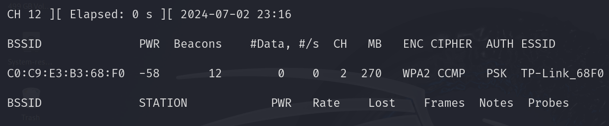
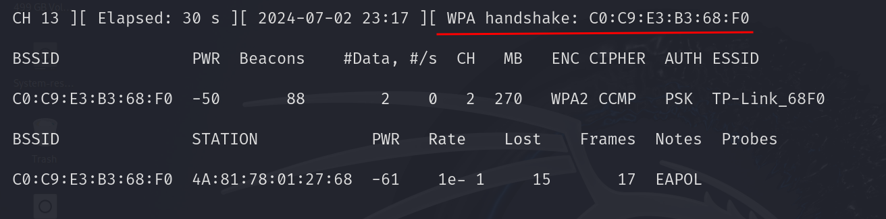
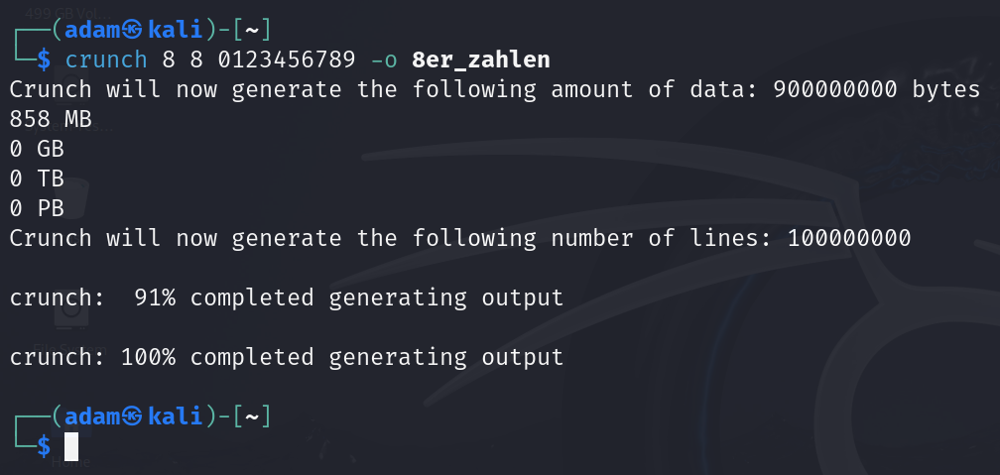
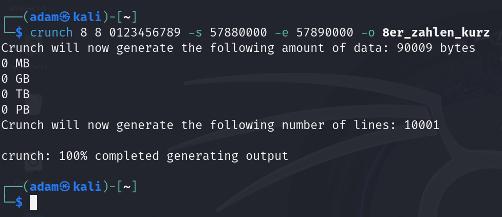
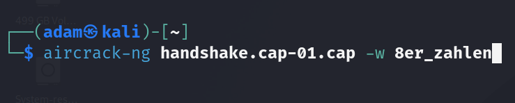
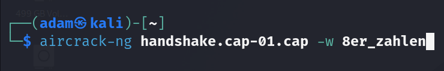
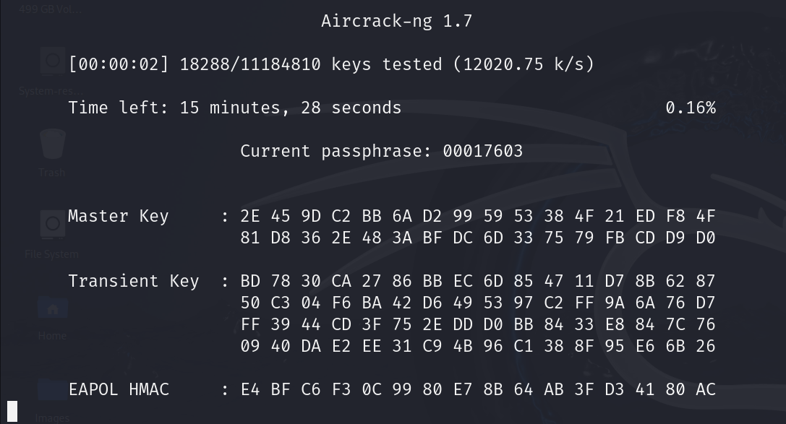
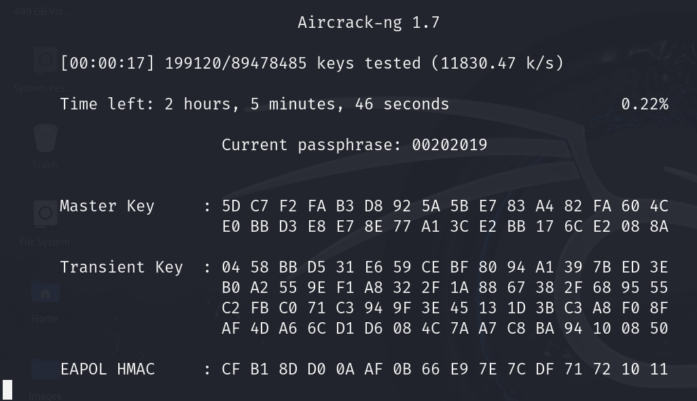
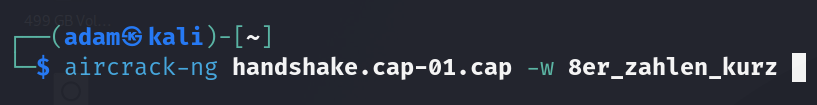

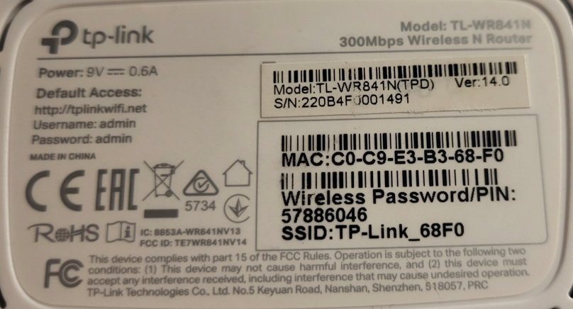


<div align="center">

Über den Author  
 
 
Chief of Security (Sarif Industries)<br>
Member of Task Force 29 <br>

Discord Server

 
 
</div>


