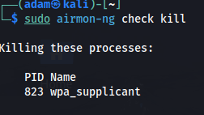
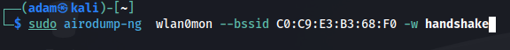
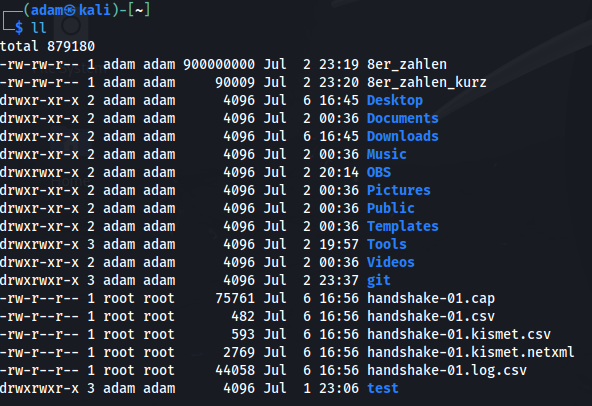
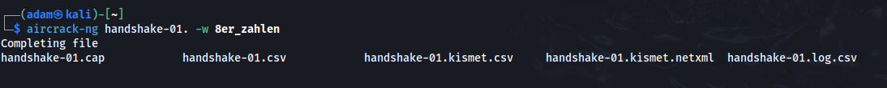
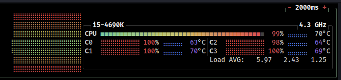
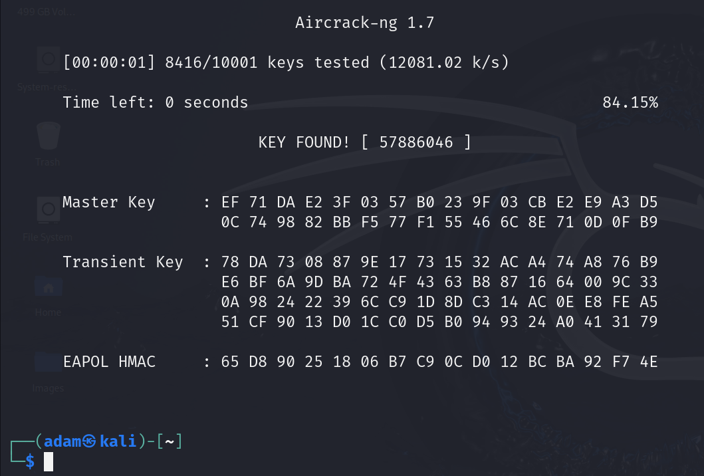
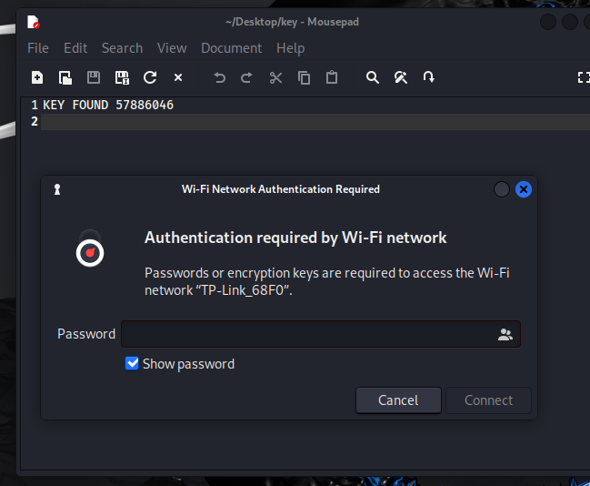
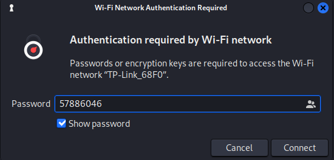
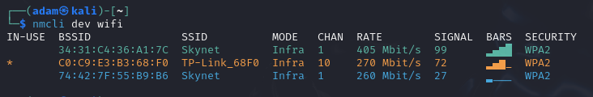

# Tutorial WPA2 Handshake bruteforcen:

### Worum geht es:

Natürlich gibt es viele weitere Programme (Wireshark, Airgeddon, usw..) mit denen dies möglich ist.
Hier geht es aber um die Grundlagen und um die Standardprogramme, die bei Kali Linux ab Werk mit an Bord sind.
Achtung gerade Hacks mit Kali bei denen man auf Hardware (hier die WLAN-Karte) zugreifen muss kann in einer VM-Schwierigkeiten machen.
Daher empfehle ich Anfänger eine Linux Installation auf einen alten Rechner zu bevorzugen, um mal überhaupt mit der Materie in Berührung zu kommen


## Wichtiger Hinweis:

Die gezeigten Methoden, Befehle und Techniken dienen der Sensibilisierung und dem Selbststudium, und dürfen unter gar keinen Umständen für böse Absichten eingesetzt werden. Darüber hinaus ist es in Deutschland strafbar fremde Netzwerke, Webseite, Server oder ähnliches zu hacken, ohne schriftliche Genehmigung des Eigentümer

### Voraussetzungen 

Hardware: Laptop/Rechner mit WLAN-Karte<br>
Software: aktuelle [Kali](https://www.kali.org/get-kali/#kali-installer-images)  Version.

### Let´s Hack

Zunächst müssen wir die WLan-Karte in den Monitormodus versetzen, denn wir benötigen diese es unser Werkzeug.
* WLAN-Karte vorbereiten
  ```sh
  sudo airmon-ng start wlan0 
  ```


Wir werden von Kali darauf hingewiesen, dass noch zwei Prozesse auf die Karte zugreifen. Uns wird auch der passende Befehl angeboten um diese beiden Prozesse zu beenden (killen)
  
  ```sh
  sudo airmon-ng check kill
  ```



Danach steht und die Wlan-Karte voll und ganz zur Verfügung.
Nun schauen wir was wir alles in unsrer Umgebung empfangen können.
  ```sh
  sudo airodump-ng start wlan0mon
  ```
wlan0mon ist nun der Name unseres Netzwerkinterfaces, welches sich im Monitor-Mode befindet daher das "mon" am Ende


Was sehen wir nun? Wie kann man das angezeigte interpretieren?
Wir sehen also drei Netzwerk in der Reichweite.
In der ersten Spalte sehen wir die einzigartigen BSSID von den Netzwerken, gefolgt von der Spalte PWR als Abkürzung für Power die Werte, die wir hier sehen sind immer negativ da sich diese auf die Signalstärke in dBm beziehen. Diese Zahl ist ein Indikator dafür, wie nah man an einem Netzwerkteilnehmer ist.
Beispiel ein Netzwerk mit dem Wert -35 ist näher an unserem Laptop als ein Netzwerk mit -54. Allgemein gilt beim WLan-Hacking je dichter desto besser
Die Spalte ENC steht für die Verschlüsselungsart Welche Verschlüsselungsarten gibt es OPN= open/offen/ohne Verschlüsselung, WEP, WPA2 und WPA3
Die letzte Spalte ist die ESSID umgangssprachlich oft als SSID bzw. "Wlan-Namen" bekannt. ESSID steht für Extended Service Set Identifier
Hier sehen wir erste wichtige Hinweise.
Es handelt sich um ein Gerät der Marke TP-Link und es scheint nicht Benutzer angepasst worden zu sein, da die ESSID bei allen wirklich allen TP-Link Produkten mir Wlan immer demselben Schema folgt. Der Markenname + die letzten 4 Zeichen der MAC-Adresse des Gerätes diese sehen wir auch in der ersten Spalte BSSID. Konkret also "68F0"
 
Um eine WPA2-Verschlüsselung zu erraten benötigen wir den Handshake zwischen dem Sender und Empfänger dazu benutzen wir den folgenden Befehl

  ```sh
  sudo airodump-ng start wlan0mon --bssid   C0:C9:E3:B3:68:F0 -w handshake
  ```


 Mit diesem Befehl weisen wir an, dass wir nur die Datenpakte die mit der angegebenen BSSID zu tun haben, also unserem Zielnetzwerk, aufgezeichnet werden sollen.
 Die gesamte Aufzeichnung soll in die mit dem Parameter -w (write) in die Datei handshake geschrieben werden. Diese Bezeichnung ist nicht zwingend, man hätte es auch hugo nennen können aber gewöhnt euch gleich an die Dinge richtig zu erledigen. Das Programm erstellt uns automatisch die benötige .cap Datei. Dieser werden wir in zukünftig folgenden Anleitungen bei Wireshark wieder sehen.

 Es öffnet sich nun die folgende Anzeige mit unserem Zielnetzwerk


Hier ist nun besonders die Stelle oben rechts für uns interessant, denn nun gilt es den Hanshake einzufangen bzw. aufzuzeichnen.
Auch hierzu gibt es wieder einmal mehrere Ansätze. Zum Beispiel warten bis sich ein Gerät wie ein Handy mit dem Netzwerk verbindet. Man kann aber mit dem DEAUTH-Befehl verbundene Geräte kurz aus dem Netzwerk kicken. Diese verbinden sich dann direkt wieder mit dem WLAN-Sender und man bekommt den Handshake. Darum soll es hier aber jetzt nicht gehen. Zu diesen Schulungszwecken habe ich ein Handy mit den Netzwerk verbunden.


Nun können wir erkennen dass mindestens ein Handshake aufgezeichnet wurde. Nun können wir dich Aufzeichnung des WLAN-Verkehrs mit der Tastenkombination STRG+C beenden

  ```sh
  [STRG]+[C] 
  ```


Nun kommt die Stelle die ein Skriptkiddi von einem Penetration Tester unterscheidet

"Spezialwissen" über TP-Link
- TP-Link verwendet bei allen WLAN-Produkten den WPA2-Mindeststandart bei der Passwortlänge also 8 Zeichen.
- Die WLAN-Passwörter bei TP-Link bestehen in der Grundkonfiguration immer nur aus Zahlen

Kali verfügt über eine mächtige eingebaut Wordliste die Rockyou.txt aber ein Angriff auf die Verschlüsselung würde nichts bringen, da dort nicht das benötigte Passwort drinsteht.

Daher generieren wir uns die passende Passwordliste mit dem folgenden Befehl

  ```sh
  crunch 8 8 0123456789 -o 8er_zahlen
  ```


Wir nutzen das Programm Crunch um uns eine Liste mit Passwörter erstellen zu lassen. Wir geben folgende dabei an: Mindestlänge des PW ist 8 Maximallänge des PW ist 8. Woraus soll das Passwort bestehen nur aus den Zahlen 0123456789 und alles soll mit dem Parameter -o (Output) in die Datei 8er-zahlen geschrieben werden. Das Programm zeigt uns die zu erwartende Dateigröße von ca. 860MB. 
Wenn man sich größer Wortlisten erstellen lässt, gibt das Programm zyklisch Statusupdates in der Form von "crunch: 91% completed generating output" raus

Direkt im Anschluss habe ich mir noch zu Vorführungszwecken eine angepasste Version erstellt. Die ist wesentlich kürzer und somit schneller. Damit dauert der Vorgang nur ein paar Sekunden und nicht Stunden.


  ```sh
  crunch 8 8 0123456789 -s 57880000 -e 78890000  -o 8er_zahlen_kurz
  ```

Die Option -s (start) gibt an ab Welchen Zahlenanfang bzw. Offset das Programm beginnen soll.
Die Option -e (end) gibt an bis zu welchen Zahlenwert das Programm arbeiten soll.


Diese verkürzte und angepasste Liste ist nicht mal 1 MB groß.


Nun prüfen wir ob wir alles haben, was wir benötigen, dazu tippen wir den folgenden Befehl ein.

  ```sh
  ll
  ```


Ihr sollte jetzt die gleichen Dateien haben.
Am wichtigsten ist die Datei mit der Endung CAP. Dort ist der Handshake drin, den wir knacken wollen.

Nun können wir ans "cracken" gehen.

  ```sh
  aircrack-ng handshake-01.cap -w 8er_zahlen
  ```




Dieser Vorgang dauert je nach Hardware und Passwortliste von einigen Stunden bis hin zu Tagen.


Hier sieht man nun den eigentlichen Crack-Prozess. Das Programm versucht mit jeden "Wort" aus der Wortliste den Handshake zu knacken. Da wir aber wissen, dass es eine reine 8-stellige Zahlenkombination ist sehen wir hier das Programm dies mit Zahlen machen. In der Grafik oben wird gerade das Passwort "00017603" getestet. Wir haben bereits 0.16% der Passwortliste abgearbeitet. 


Dieser Prozess benötig viel Hardwareleistung:
Profis nutzen dafür die GPU der Grafikkarte. Hier für unsere Schulungszwecke reicht die Leistung der CPU völlig aus.



Sehr schnell passt sich geschätzte Zeitdauer an. Als Faustformel kann man sagen, dass ein Passwort mit 8 Stellen (nur Zahlen) über Nacht geknackt werden kann.


Da wir aber hier zur Schulungszwecken direkt nach wenigen Sekunden einen Erfolg sehen wollen, nutzen wir die kleinere Wortliste "**8er_zahlen_kurz**". Somit sparen wir uns mehrere Stunden.



Den Erfolg kann man direkt sehen, denn nach nicht mal einer Sekunde und 84,15% wurde das richtige Passwort erraten. Es ist **57886046**


Ein kurzer Blick unter den Router verrät, dass wir das richtige Passwort haben.

Zusatzwissen: Was sagt uns dies jetzt über den Benutzer/Admin des Routers?
  
  -Der Router ist komplett default (ESSID und das Werkspasswort)
  -Die Wahrscheinlichkeit, dass die Logindaten des Routers auch noch default ist, ist sehr hoch.
  -Es gibt viele Seiten wo man die Default-Passwörter der Hersteller/Modell einsehen 


Wir notieren und den gefunden Key und starten den Rechner neu.
Da wir unsere WLAN-Karte in den Monitormode versetzt haben können wir uns nicht direkt mit dem geknackten WLAN verbinden.

Der einfachste Weg wieder alles in default zu bekommen ist ein Neustart.
Einfach über die Konsole mit dem Befehl

  ```sh
  sudo reboot now
  ```

Danach können wir uns mit den verschlüsselten WLAN verbinden:

 





Nun sind wir verbunden. 
Trotzdem checken wir es nochmal.
Dazu in der Konsole den folgenden Befehl eingeben

  ```sh
  nmcli dev wifi
  ```


 
 **Jawohl unser erster WLAN-Hack war erfolgreich!**

 In diesem Git-Repository ist mein Handshake meiner Hardware drin. Und ich erlaube euch ausdrücklich mit diesem zu spielen und zu testen. Jetzt habt Ihr alles, was ihr braucht. Viel Spaß beim Nachmachen.


<div align="center">

 **Adam Jensen**
 {: width="250" height="300"} 

  Chief of Security (Sarif Industries)
  Member of Task Force 29 
</div>


